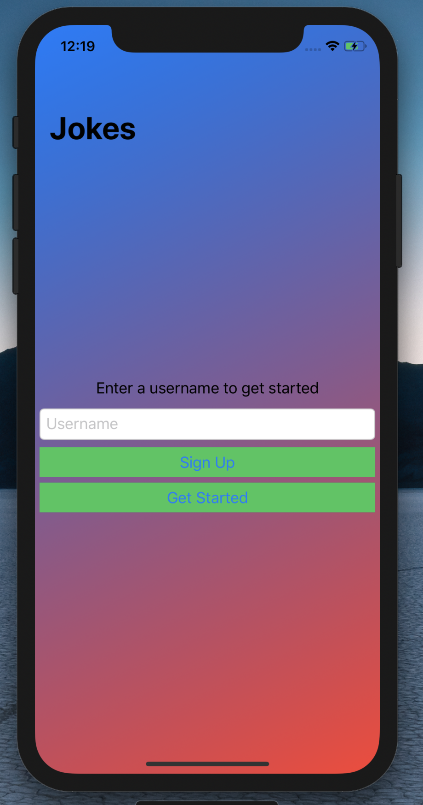
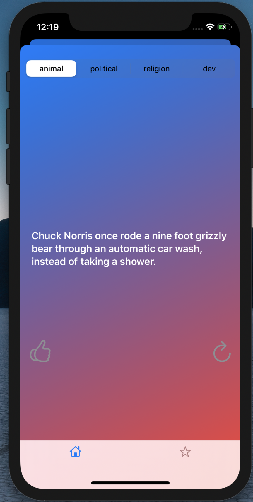
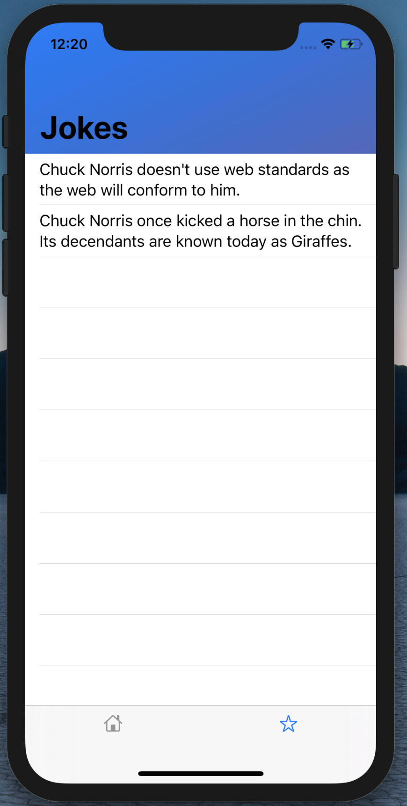
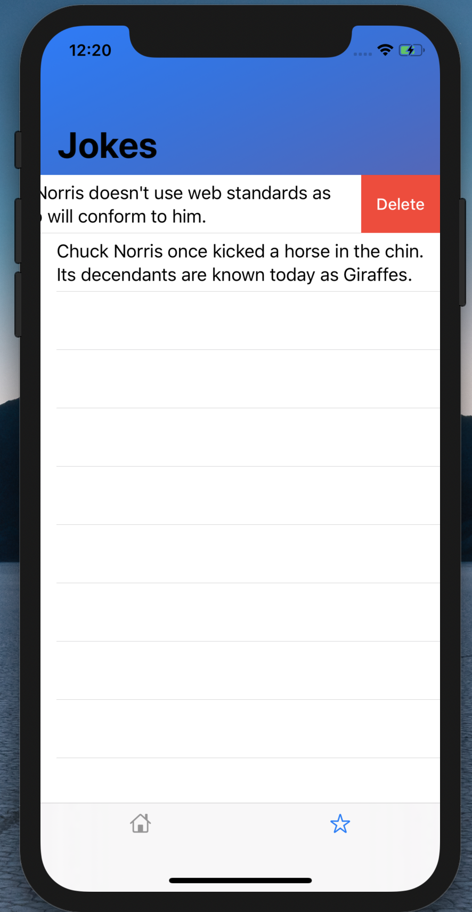

# chuck_norris_jokes_app

You get to read different chuck norris jokes for different categories like politics, religion, programming or animals. When you select one of these categories, you will get a random joke in that category. And if you like the joke, you can save it so you can show it your friends or read yourself in future.
  
  
  I implemented the backend of this app in Flask. Based on different routes, it will send back different response. For example, ( baseURL + jokes/random?category=dev ) will return a random joke of 'dev' category in json format. 
  
  
   From iOS side, i used URLSessions to communicate with the server and getting the json response back which I converted to my swift 'Joke' struct using Codable.

User can sign up using entering a username. The user will be asked to sign up or log in just once in order to create a user in the database to keep track of all the liked jokes. In future, when user comes back to the back, the user will be validated using UserDefaults.

The user can choose any category from the picker. And a random joke from that category will be displayed which the user can like and save it for future.

Shows the liked jokes of the users.

Can delete the joke! from the view and from the database as well!

<h3>I also have my Flask source code in different repository.</h3>

